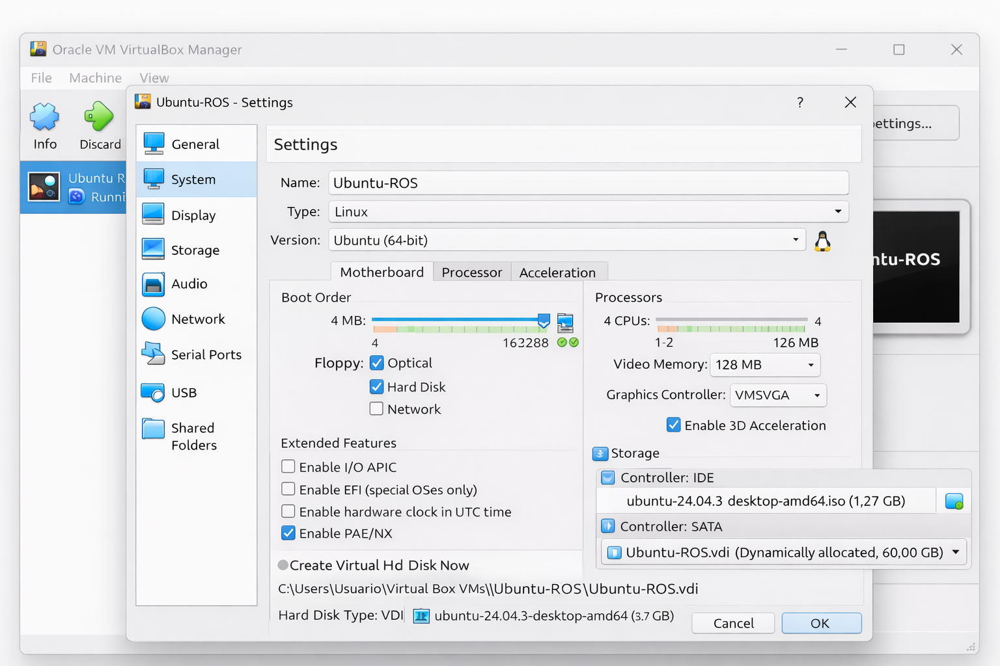
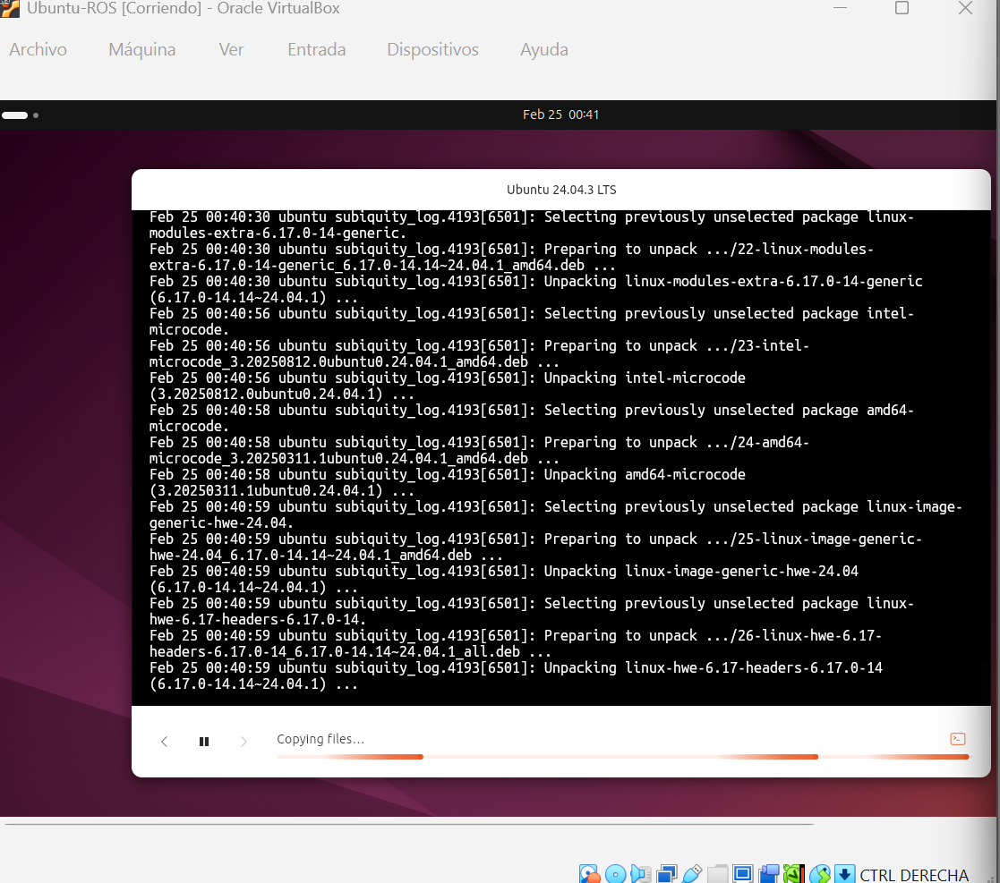
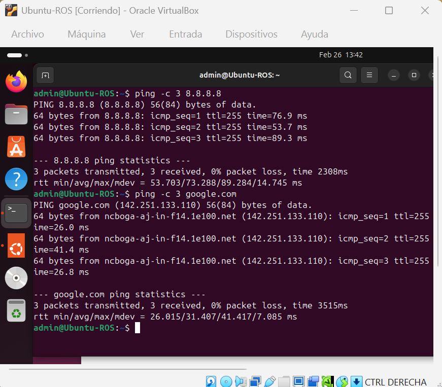
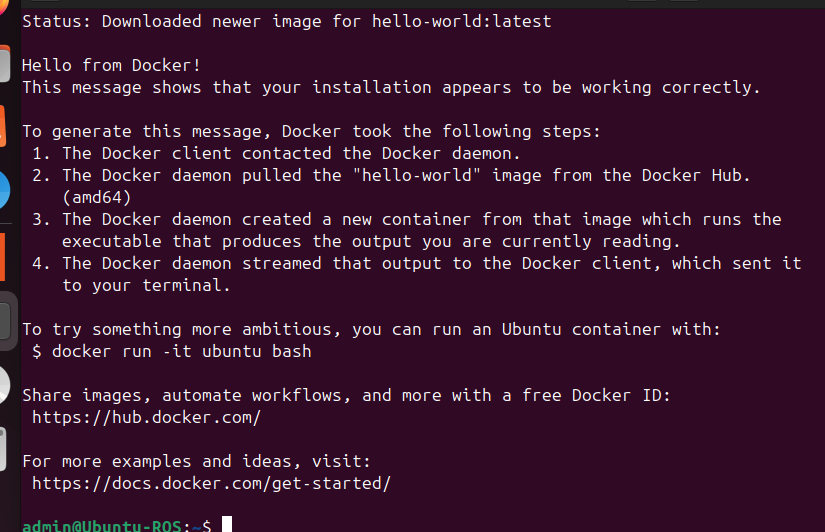
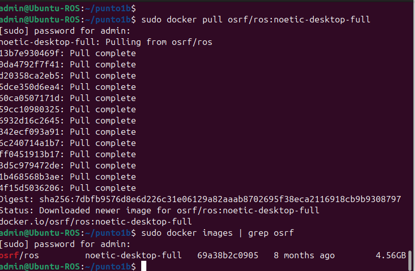
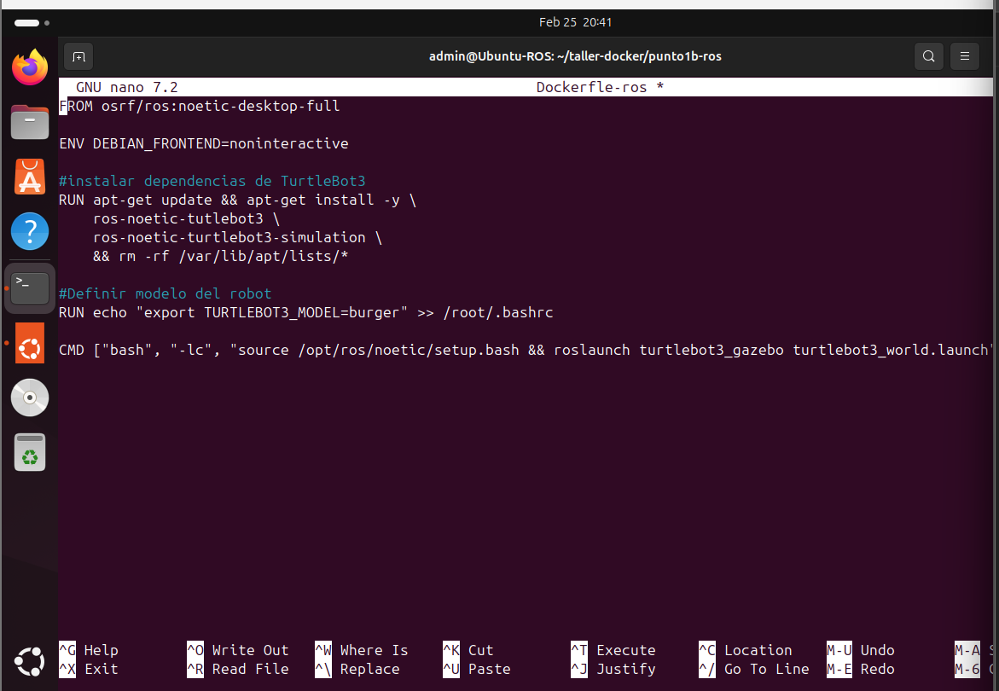
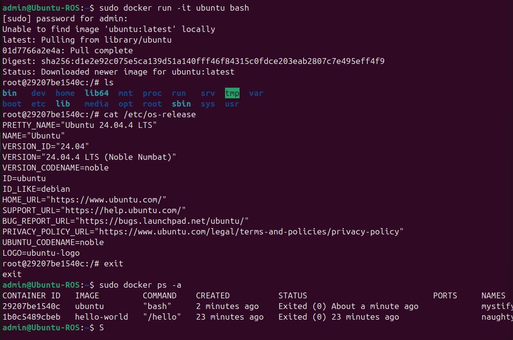
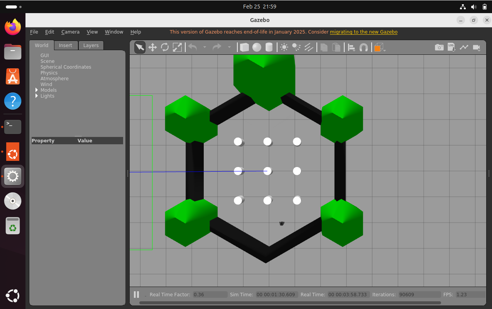

### Taller-Docker
Primer taller de Docker, ROS y redes

## Integrantes

-Lesly Juliana Ascencio Peréz

## Objetivo

El objetivo de este taller es aprender el uso de Docker para la ejecución de contenedores,la simulación de robots con ROS y el análisis de protocolos de red como ARP e ICMP.

## Requisitos

-Docker Desktop
-GitHub
-PowerShell
-Wireshark
-Sistema Operativo Windows / Linux

## Instalación de Docker

Docker fue instalado utilizando Docker Desktop en Windows.
Se verificó la instalación ejecutando los siguientes comandos:


## Punto 1.a – Ejecución de contenedores Docker
## ¿Qué se hizo?
En este punto se ejecutó un contenedor Docker que reproduce un video
utilizando caracteres ASCII directamente en la terminal.

## ¿Cómo se hizo?

Para la ejecución del video en formato ASCII se utilizó un contenedor Docker
basado en la imagen `wernight/funbox`, ejecutando el siguiente comando:

bash
docker run --rm -it wernight/funbox cvlc --no-audio -V caca /examples/countdown.mp4


## ¿Qué se obtuvo?
Como resultado, se visualiza una cuenta regresiva en formato ASCII
dentro de la consola. El contenedor se elimina automáticamente al finalizar
la ejecución, lo que evita dejar contenedores innecesarios en el sistema.

### Evidencia


🎥 Video de evidencia:  
[Ver video ASCII en Docker](video-ascii.mp4)


### Punto 1.b- Dcoker + ROS + Gazebo

Simulación de un TurtleBot3 en Gazebo
En este punto se utilizó Docker para ejecutar ROS Noetic junto con Gazebo, con el objetivo de simular un robot TurtleBot3 en un entorno gráfico, validando la correcta integración entre contenedores Docker, ROS y visualización por X11.

## Preparación del entorno

## 1.Configuración de la Máquina Virtual

Se creó una máquina virtual con las siguientes características:

- Sistema Operativo: Ubuntu 20.04 LTS

- Hipervisor: VirtualBox

- Memoria RAM: mínimo 4 GB

- CPU: 2 núcleos o más

- Aceleración gráfica: habilitada

## Configuración de red

La máquina virtual se configuró con Adaptador NAT, lo que permite acceso a Internet sin configuraciones adicionales.



Se realiza instalación del sistema operativo Ubuntu 24.04.3 desktop 



Se realiza prueva de conectividad de la MV a Internet con los siguientes comandos 

```bash
ping -c 3 8.8.8.8
ping -c 3 google.com
```
y se evidencia que hay ping sin perdida de paquetes



### Instalación de Docker en la Máquina Virtual
Se actualizó el sistema e instaló Docker desde los repositorios oficales de Ubuntu con los siguientes comandos 

```bash
sudo apt update
sudo apt install -y docker.io
```

Se habilitó el servicio de docker:

```bash
sudo systemctl start docker
sudo systemctl enable docker
```

y se realiza la verificación de Docker ejecuntando el contenedor de prueba "hello-world".
```bash
sudo docker run hello-world
```
Como resultado, se obtuvo el mensaje "Hello from Docker!", confirmando que el demonio de Docker está activo.



## Descarga de la imagen base de ROS
Se descargó la imagen oficial de ROS Noetic con soporte completo para escritorio y simulación

```bash
docker pull osrf/ros:noetic-desktop-full
```


## Creación del Dockerfile para ROS y Gazebo
Se creó un archivo llamado Dockerfile-ros para construir una imagen personalizada con TurtleBot3 y Gazebo.

```bash
FROM osrf/ros:noetic-desktop-full

ENV DEBIAN_FRONTEND=noninteractive

RUN apt-get update && apt-get install -y \
    ros-noetic-turtlebot3 \
    ros-noetic-turtlebot3-gazebo \
    && rm -rf /var/lib/apt/lists/*

ENV TURTLEBOT3_MODEL=burger

CMD ["bash"]
```


## Construcción de la imagen Docker
Se construyó la imagen personalizada a partir del Dockerfile.

```bash
sudo docker build -t ros-gazebo -f Dockerfile-ros .
```
## Ejecución del contenedor con soporte gráfico
Para permitir la visualización de Gazebo desde el contenedor se habilitó el acceso al servidor X11

```bash
xhost +local:docker
```

Luego se ejecutó el contenedor

```bash
sudo docker run -it --rm \
  --name ros-gazebo \
  -e DISPLAY=$DISPLAY \
  -v /tmp/.X11-unix:/tmp/.X11-unix:rw \
  ros-gazebo
```


## Ejecución de la simulación en Gazebo
Dentro del contenedor se inicializo ROS y lanzó el entorno de simulación

```bash
source /opt/ros/noetic/setup.bash
export TURTLEBOT3_MODEL=burger
roslaunch turtlebot3_gazebo turtlebot3_world.launch
```



Se logró configurar exitosamente una máquina virtual con Ubuntu, instalar Docker y ejecutar una simulación gráfica de TurtleBot3 en Gazebo, utilizando ROS Noetic dentro de un contenedor Docker.

Esta configuración demuestra el uso de Docker como herramienta para desplegar entornos robóticos complejos de manera portable y reproducible.
