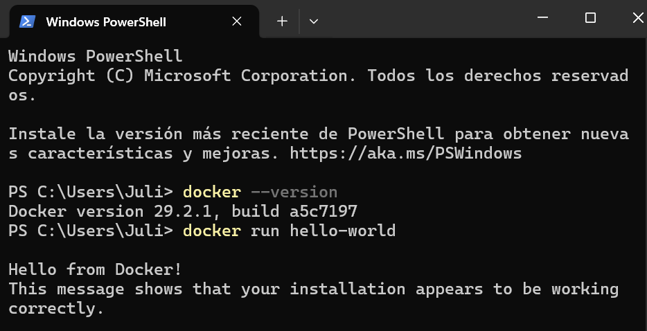
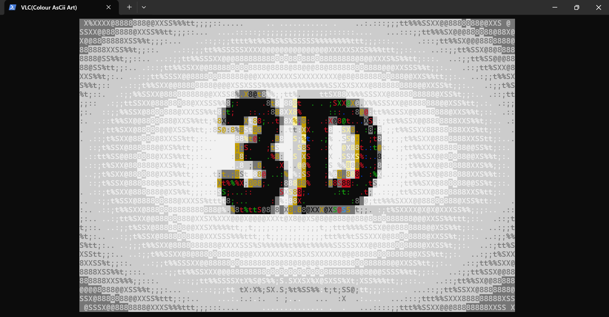

# Taller-Docker
Primer taller de Docker, ROS y redes

## Integrantes

-Lesly Juliana Ascencio Peréz

## Objetivo

El objetivo de este taller es aprender el uso de Docker para la ejecución de contenedores,la simulación de robots con ROS y el análisis de protocolos de red como ARP e ICMP.

## Requisitos

-Docker Desktop
-GitHub
-PowerShell
-Wireshark
-Sistema Operativo Windows / Linux

## Instalación de Docker

Docker fue instalado utilizando Docker Desktop en Windows.
Se verificó la instalación ejecutando los siguientes comandos:

## Punto 1.a – Ejecución de video ASCII en Docker
## ¿Qué se hizo?
En este punto se ejecutó un contenedor Docker que reproduce un video
utilizando caracteres ASCII directamente en la terminal.

## ¿Cómo se hizo?
Para ello se utilizó el siguiente comando:

docker run --rm -it wernight/funbox cvlc --no-audio -V caca /examples/countdown.mp4

## ¿Qué se obtuvo?
Como resultado, se visualiza una cuenta regresiva en formato ASCII
dentro de la consola. El contenedor se elimina automáticamente al finalizar
la ejecución, lo que evita dejar contenedores innecesarios en el sistema.

### Evidencia

🎥 Video de evidencia:  
[Ver video ASCII en Docker](video-ascii.mp4)

